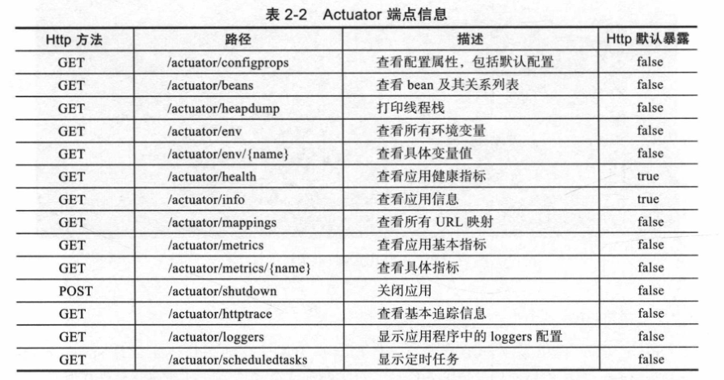

# 第2章 实战前的准备工作

## 2.1 开发环境的准备

略。

## 2.2 Spring Boot入门

### 2.2.1 Spring Boot简介

略。

### 2.2.2 搭建Spring Boot项目

略。

### 2.2.3 编写第一个REST接口

略。

### 2.2.4 读取配置文件

**读取配置 3 种方式：**

- `Environment.getProperty`
- `@Value("${}")`
- `@ConfigurationProperties(prefix="")`

### 2.2.5 profiles多环境配置

略。

### 2.2.6 热部署

1. 添加依赖：

   ```xml
   <dependency>
       <groupId>org.springframework.boot</groupId>
       <artifactId>spring-boot-devtools</artifactId>
   </dependency>
   ```

2. 配置自动编译：`File | Settings | Build, Execution, Deployment | Compiler` 菜单下 `Make project automatically`。

3. IDEA 开启自动编译：`Shift+Ctrl+Alt+/`，选择 `Registry...`，选中 `compiler.automake.allow.when.app.running`。

> **最新版 IDEA：**
>
> - `Make project automatically` 好像改为了 `Build project automatically`。
> - `compiler.automake.allow.when.app.running` 好像改为了 `compiler.automake.allow.parallel`。

### 2.2.7 actuator监控

**依赖：**

```xml
<dependency>
    <groupId>org.springframework.boot</groupId>
    <artifactId>spring-boot-starter-actuator</artifactId>
</dependency>
```

**Actuator 端点信息：**



**配置：**

- 显示详情：`management.endpoint.health.show-details=ALWAYS`
- 需要暴露的端点：`management.endpoints.web.exposure.include=configprops,beans`
- 暴露全部端点：`management.endpoints.web.exposure.include=*`

### 2.2.8 自定义actuator端点

**扩展健康端点：**

- UserHealthIndicator：

  ```java
  @Component
  public class UserHealthIndicator extends AbstractHealthIndicator {
      @Override
      protected void doHealthCheck(Builder builder) throws Exception {
          builder.up().withDetail("status", true);
          //builder.down().withDetail("status", false);
      }
  }
  ```

- 访问 <http://localhost:8080/actuator/health>：

  ```json
  {
      "status":"UP",
      "details":{
          "user":{
              "status":"UP",
              "details":{
                  "status":true
              }
          },
          ...
      }
  }
  ```

**自定义端点：**

- UserEndpoint：

  ```java
  @Component
  @Endpoint(id = "user")
  public class UserEndpoint {
      @ReadOperation
      public List<Map<String, Object>> health() {
          List<Map<String, Object>> list = new ArrayList<>();
          Map<String, Object> map = new HashMap<>();
          map.put("userId", 1001);
          map.put("userName", "yinjihuan");
          list.add(map);
          return list;
      }
  }
  ```

- 访问 <http://localhost:8080/actuator/user>：

  ```json
  [
      {
          "userName": "yinjihuan",
          "userId": 1001
      }
  ]
  ```

### 2.2.9 统一异常处理

略。

### 2.2.10 异步执行

- `@EnableAcync`：开启。

- `@Async`：要在外部类调用，本类调用不起作用。

- 自定义线程池：

  ```java
  @Configuration
  public class AsyncTaskExecutePool implements AsyncConfigurer {
      public Executor getAsyncExecutor() {
          ThreadPoolTaskExecutor executor = new ThreadPoolTaskExecutor();
          ...
          executor.initialize();
          return executor;
      }
      
      public AsyncUncaughtExceptionHandler getAsyncUncaughtExceptionHandler() {
          ...
      }
  }
  ```

- 拒绝策略：`RejectedExecutionHandler`：

  - `AbortPolicy`：直接抛出异常。
  - `CallerRunsPolicy`：直接在调用者线程执行。

### 2.2.11 随机端口

- 配置随机端口：`server.port=${random.int[2000,8000]}`。
- 判断端口是否被占用：NetUtils，通过检测 Socket 是否可以连接。

> [Stack Overflow - Sockets: Discover port availability using Java](https://stackoverflow.com/questions/434718/sockets-discover-port-availability-using-java)

### 2.2.12 编译打包

略。

## 2.3 Spring Boot Starter自定义

### 2.3.1 Spring Boot Starter项目创建

略。

### 2.3.2 自动创建客户端

- *META-INF/spring-factories*。

### 2.3.3 使用Starter

略。

### 2.3.4 使用注解开启Starter自动构建

```java
...
@Import({UserAutoConfigure.class})
public @interface EnableUserClient {
}
```

### 2.3.5 使用配置开启Starter自动构建

```java
@ConditionalOnProperty(prefix = "spring.user",value = "enabled",havingValue = "true")
```

### 2.3.6 配置Starter内容提示

- *META-INF/spring-configuration-metadata.json*。

## 2.4 本章小结

略。
