# 2 Jenkins 安装和持续集成环境配置

## 2.1 持续集成流程说明


1. 首先，开发人员每天进行代码提交，提交到Git仓库。
2. 然后，Jenkins 作为持续集成工具，使用 Git 工具到 Git 仓库拉取代码到集成服务器，再配合 JDK，Maven 等软件完成代码编译，代码测试与审查、测试、打包等工作，在这个过程中每一步出错，都重新再执行一次整个流程。
3. 最后，Jenkins 把生成的 jar 或 war 包分发到测试服务器或者生产服务器，测试人员或用户就可以访问应用。

### 2.1.1 服务器列表

本课程虚拟机统一采用 CentOS 7。

| 名称           | IP 地址        | 安装的软件                                            |
| -------------- | -------------- | ----------------------------------------------------- |
| 代码托管服务器 | 192.168.66.100 | Gitlab 12.4.2                                         |
| 持续集成服务器 | 192.168.66.101 | Jenkins 2.190.3，JDK 1.8，Maven 3.6.2，Git，SonarQube |
| 应用测试服务器 | 192.168.66.102 | JDK 1.8，Tomcat 8.5                                   |

## 2.2 Gitlab 代码托管服务器安装

### 2.2.1 Gitlab 简介


官网： https://about.gitlab.com/。

GitLab 是一个用于仓库管理系统的开源项目，使用 Git 作为代码管理工具，并在此基础上搭建起来的 web 服务。

GitLab 和 GitHub 一样属于第三方基于 Git 开发的作品，免费且开源（基于 MIT 协议），与 Github 类似，可以注册用户，任意提交你的代码，添加 SSHKey 等等。不同的是，GitLab 是可以部署到自己的服务器上，数据库等一切信息都掌握在自己手上，适合团队内部协作开发，你总不可能把团队内部的智慧总放在别人的服务器上吧？简单来说可把 GitLab 看作个人版的 GitHub。

### 2.2.2 Gitlab安装

**1. 安装相关依赖**

```shell
yum -y install policycoreutils openssh-server openssh-clients postfix
```

**2. 启动 ssh 服务 & 设置为开机启动**

```shell
systemctl enable sshd && sudo systemctl start sshd
```

**3. 设置 postfix 开机自启，并启动，postfix 支持 gitlab 发信功能**

```shell
systemctl enable postfix && systemctl start postfix
```

**4. 开放 ssh 以及 http 服务，然后重新加载防火墙列表**

```shell
firewall-cmd --add-service=ssh --permanent
firewall-cmd --add-service=http --permanent
firewall-cmd --reload
```

如果关闭防火墙就不需要做以上配置。

**5. 下载 gitlab 包，并且安装**

```shell
# 在线下载安装包
wget https://mirrors.tuna.tsinghua.edu.cn/gitlab-ce/yum/el6/gitlab-ce-12.4.2-ce.0.el6.x86_64.rpm

# 安装
rpm -i gitlab-ce-12.4.2-ce.0.el6.x86_64.rpm
```

> **🙋‍♂️报错：**
>
> **1. -bash: wget: 未找到命令**
>
> ```shell
> yum -y install wget
> ```
>
> **2. 错误: 无法验证 mirrors.tuna.tsinghua.edu.cn**
>
> ```shell
> wget https://mirrors.tuna.tsinghua.edu.cn/gitlab-ce/yum/el6/gitlab-ce-12.4.2-ce.0.el6.x86_64.rpm --no-check-certificate
> ```
>
> **3. 错误：依赖检测失败**
>
> ```shell
> yum -y install gitlab-ce-12.4.2-ce.0.el6.x86_64.rpm
> ```

**6. 修改 gitlab 配置**

修改 gitlab 访问地址和端口，默认为 80，我们改为 82：

`/etc/gitlab/gitlab.rb`

```ruby
external_url 'http://192.168.66.100:82'
nginx['listen_port'] = 82
```

**7. 重载配置及启动 gitlab**

```shell
gitlab-ctl reconfigure
gitlab-ctl restart
```

**8. 把端口添加到防火墙**

```shell
firewall-cmd --zone=public --add-port=82/tcp --permanent
firewall-cmd --reload
```

启动成功后，看到以下修改管理员 root 密码的页面，修改密码后，然后登录即可。

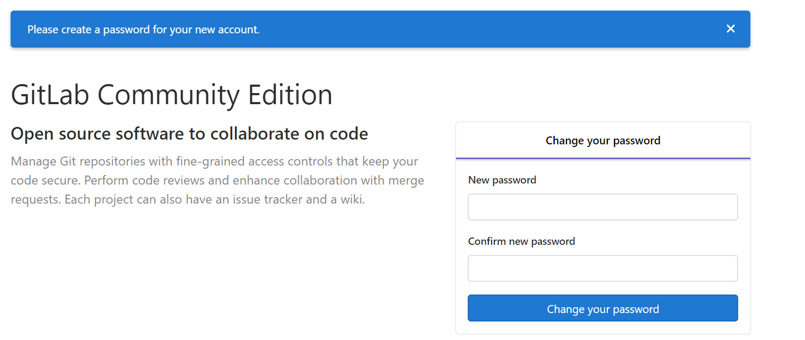

### 2.2.3 Gitlab 添加组、创建用户、创建项目

#### 创建组

使用管理员 root 创建组，一个组里面可以有多个项目分支，可以将开发添加到组里面进行设置权限，不同的组就是公司不同的开发项目或者服务模块，不同的组添加不同的开发即可实现对开发设置权限的管理。


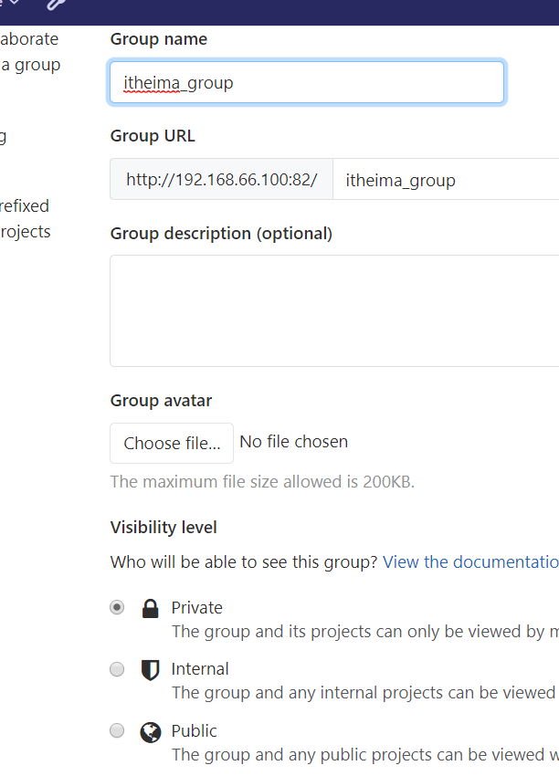

#### 创建用户

创建用户的时候，可以选择 Regular 或 Admin 类型。

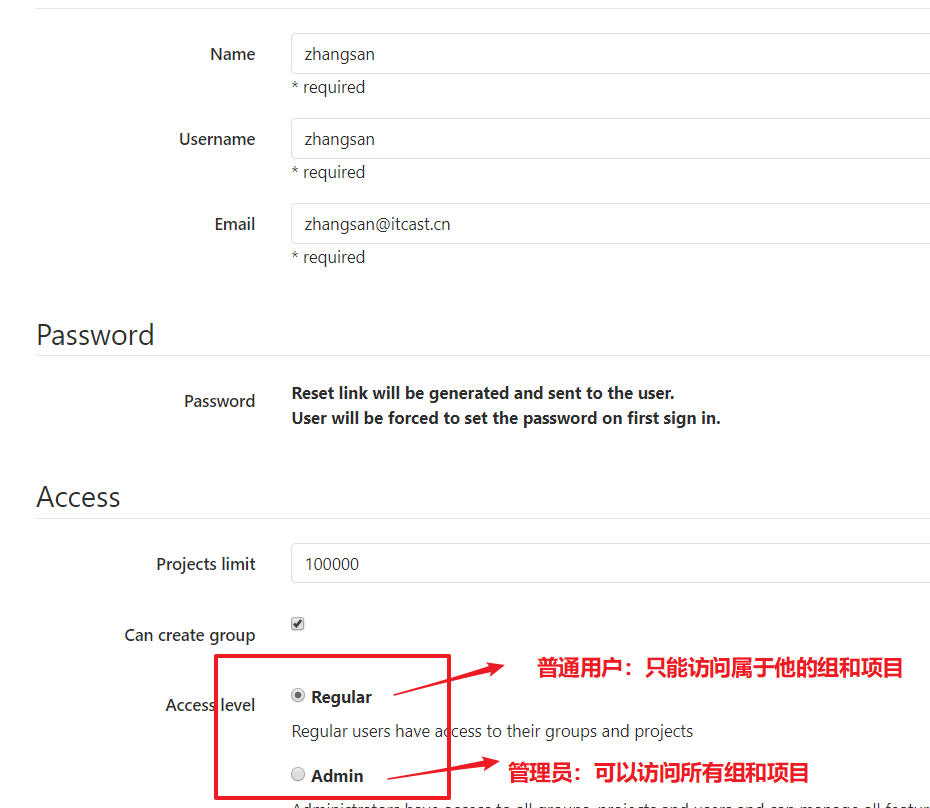

创建完用户后，立即修改密码。


#### 将用户添加到组中

选择某个用户组，进行 Members 管理组的成员。


Gitlab 用户在组里面有 5 种不同权限：

- **Guest：** 可以创建issue、发表评论，不能读写版本库。
- **Reporter：** 可以克隆代码，不能提交，QA、PM 可以赋予这个权限。
- **Developer：** 可以克隆代码、开发、提交、push，普通开发可以赋予这个权限。
- **Maintainer：** 可以创建项目、添加 tag、保护分支、添加项目成员、编辑项目，核心开发可以赋予这个权限。
- **Owner：** 可以设置项目访问权限 - Visibility Level、删除项目、迁移项目、管理组成员，开发组组长可以赋予这个权限。

#### 在用户组中创建项目

以刚才创建的新用户身份登录到 Gitlab，然后在用户组中创建新的项目。


## 2.3 源码上传到 Gitlab 仓库

下面来到 IDEA 开发工具，我们已经准备好一个简单的 Web 应用准备到集成部署。

我们要把源码上传到 Gitlab 的项目仓库中。

### 2.3.1 项目结构说明


我们建立了一个非常简单的 web 应用，只有一个 index.jsp 页面，如果部署好，可以访问该页面就成功啦！

### 2.3.2 开启版本控制

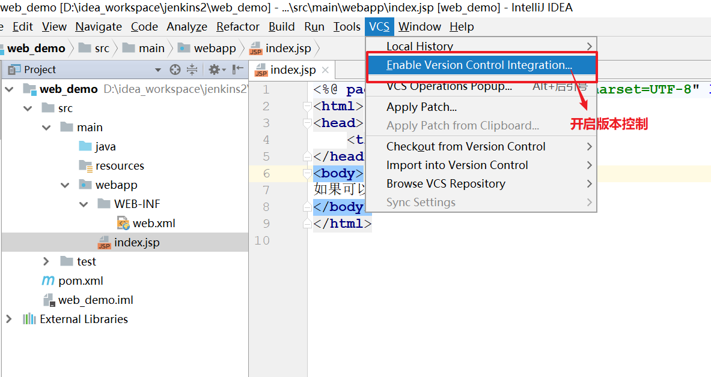


### 2.3.3 提交代码到本地仓库

先 Add 到缓存区：

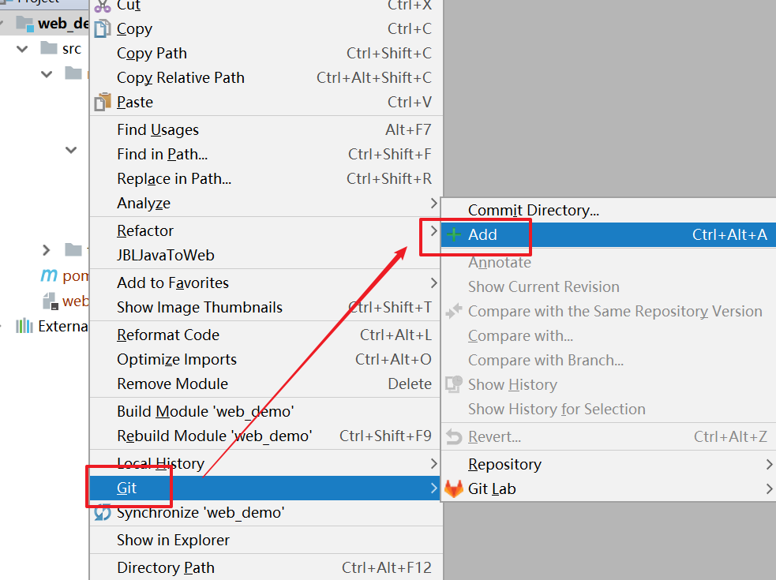

再 Commit 到本地仓库：


### 2.3.4 推送到 Gitlab 项目仓库中


这时从 Gitlab 的项目中拷贝 url 地址：


输入 Gitlab 的用户名和密码，然后就可以把代码推送到远程仓库啦：

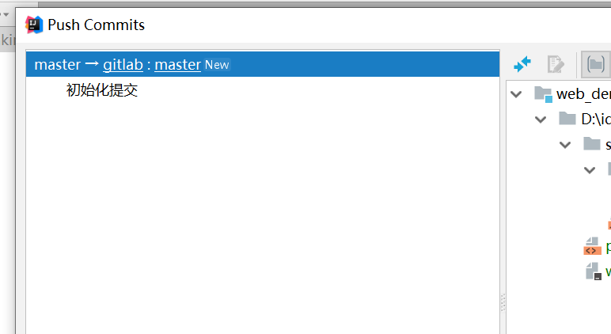

刷新 Gitlab 项目：


## 2.4 持续集成环境(1) - Jenkins 安装

**1. 安装JDK**

Jenkins 需要依赖 JDK，所以先安装 JDK 1.8：

```shell
yum install java-1.8.0-openjdk* -y
```

安装目录为：`/usr/lib/jvm`。

**2. 获取 Jenkins 安装包**

下载页面：https://jenkins.io/zh/download/。

安装文件：jenkins-2.190.3-1.1.noarch.rpm。

**3. 把安装包上传到 192.168.66.101 服务器，进行安装**

```shell
rpm -ivh jenkins-2.190.3-1.1.noarch.rpm
```

**4. 修改 Jenkins 配置**

`/etc/syscofig/jenkins`

```shell
JENKINS_USER="root"
JENKINS_PORT="8888"
```

**5. 启动 Jenkins**

```shell
systemctl start jenkins
```

**6. 打开浏览器访问**

http://192.168.66.101:8888

> **注意：** 本服务器把防火墙关闭了，如果开启防火墙，需要在防火墙添加端口。

**7. 获取并输入 admin 账户密码**

```shell
cat /var/lib/jenkins/secrets/initialAdminPassword
```

**8. 跳过插件安装**

因为 Jenkins 插件需要连接默认官网下载，速度非常慢，而且经过会失败，所以我们暂时先跳过插件安装。


**9. 添加一个管理员账户，并进入 Jenkins 后台**


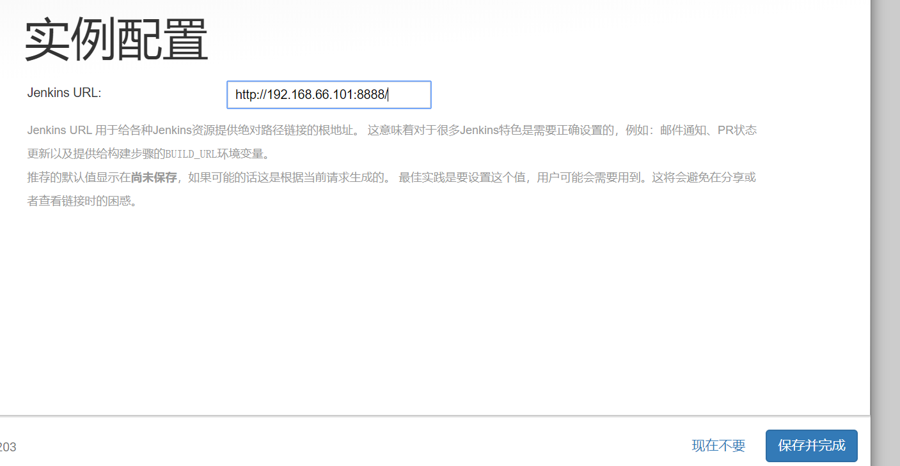

开始使用 Jenkins：

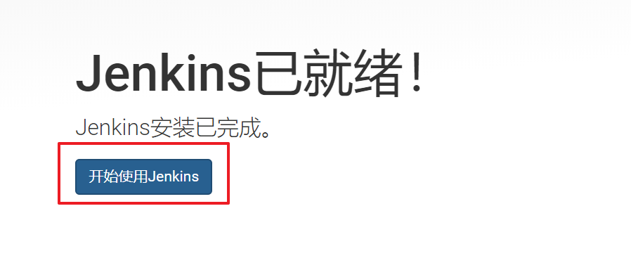


## 2.5 持续集成环境(2) - Jenkins 插件管理

Jenkins 本身不提供很多功能，我们可以通过使用插件来满足我们的使用。例如从 Gitlab 拉取代码，使用 Maven 构建项目等功能需要依靠插件完成。接下来演示如何下载插件。

#### 2.5.1 修改 Jenkins 插件下载地址

Jenkins 国外官方插件地址下载速度非常慢，所以可以修改为国内插件地址：`Jenkins->Manage Jenkins->Manage Plugins`，点击 Available：


这样做是为了把 Jenkins 官方的插件列表下载到本地，接着修改地址文件，替换为国内插件地址：

```shell
cd /var/lib/jenkins/updates
sed -i 's/http:\/\/updates.jenkins-ci.org\/download/https:\/\/mirrors.tuna.tsinghua.edu.cn\/jenkins/g' default.json && sed -i 's/http:\/\/www.google.com/https:\/\/www.baidu.com/g' default.json
```

最后，Manage Plugins 点击 Advanced，把 Update Site 改为国内插件下载地址：

```shell
https://mirrors.tuna.tsinghua.edu.cn/jenkins/updates/update-center.json
```


Sumbit 后，在浏览器输入：http://192.168.66.101:8888/restart，重启 Jenkins。

#### 2.5.2 下载中文汉化插件

`Jenkins->Manage Jenkins->Manage Plugins`，点击 Available，搜索"Chinese"：


完成后如下图：


重启 Jenkins 后，就看到 Jenkins 汉化了！（PS：但可能部分菜单汉化会失败）


## 2.6 持续集成环境(3) - Jenkins 用户权限管理

我们可以利用 Role-based Authorization Strategy 插件来管理 Jenkins 用户权限。

### 2.6.1 安装 Role-based Authorization Strategy 插件


### 2.6.2 开启权限全局安全配置

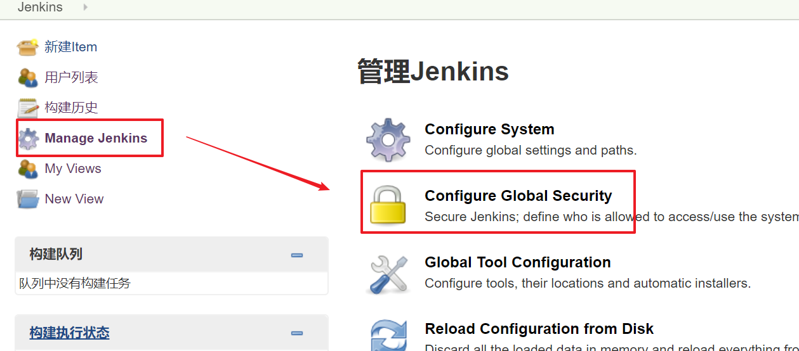

授权策略切换为"Role-Based Strategy"，保存。

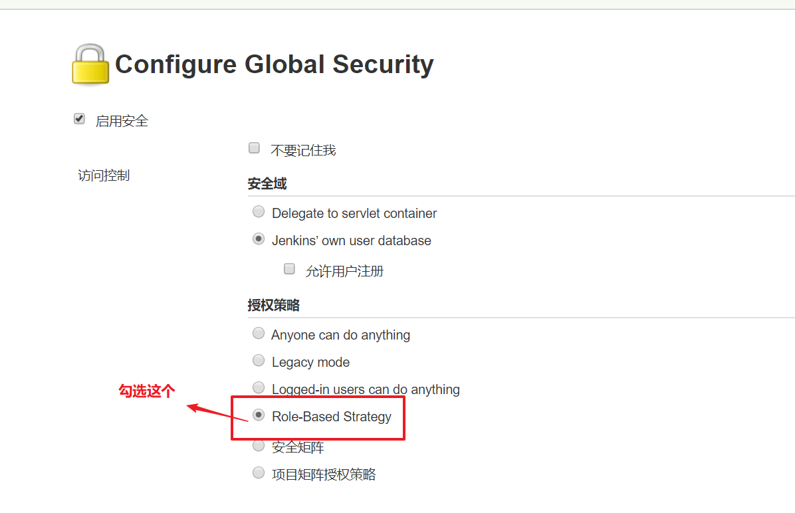

### 2.6.3 创建角色

在系统管理页面进入 Manage and Assign Roles：

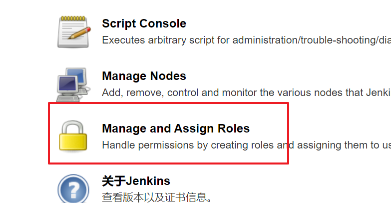

点击"Manage Roles"：

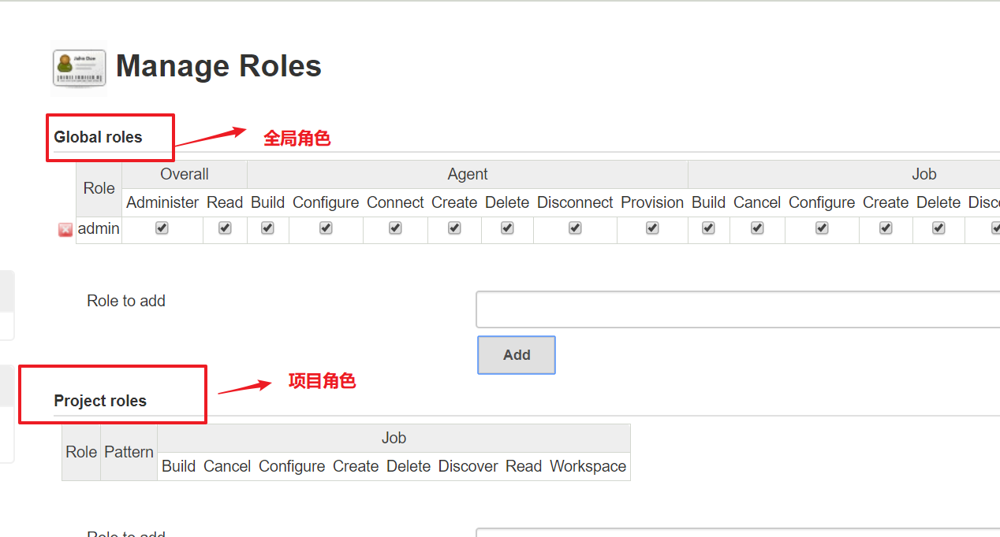

- **Global roles（全局角色）：** 管理员等高级用户可以创建基于全局的角色。
- **Project roles（项目角色）：** 针对某个或者某些项目的角色。
- **Slave roles（奴隶角色）：** 节点相关的权限。

我们添加以下三个角色：

- **baseRole：** 该角色为全局角色。这个角色需要绑定 Overall 下面的 Read 权限，是为了给所有用户绑定最基本的 Jenkins 访问权限。注意：如果不给后续用户绑定这个角色，会报错误：<font color="red">用户名 ismissing the Overall/Read permission</font>。
- **role1：** 该角色为项目角色。使用正则表达式绑定`"itcast.*"`，意思是只能操作 `itcast` 开头的项目。
- **role2：** 该角色也为项目角色。绑定`"itheima.*"`，意思是只能操作 `itheima` 开头的项目。


保存。

### 2.6.4 创建用户

在系统管理页面进入 Manage Users：

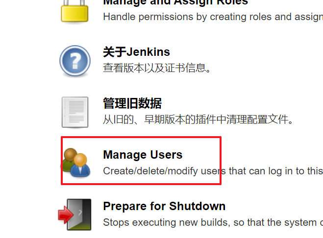


分别创建两个用户：jack 和 eric


### 2.6.5 给用户分配角色

系统管理页面进入 Manage and Assign Roles，点击 Assign Roles。

绑定规则如下：

- eric 用户分别绑定 baseRole 和 role1 角色。
- jack 用户分别绑定 baseRole 和 role2 角色。

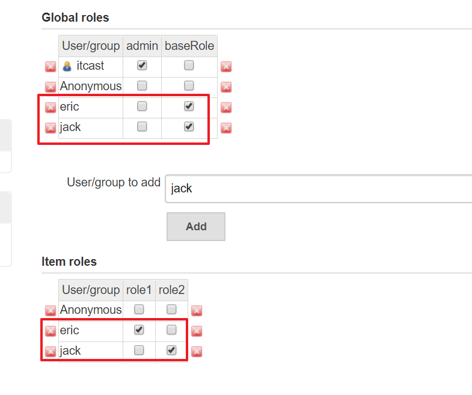

保存。

### 2.6.6 创建项目测试权限

以 itcast 管理员账户创建两个项目，分别为 itcast01 和 itheima01：


结果为：

- eric 用户登录，只能看到 itcast01 项目。
- jack 用户登录，只能看到 itheima01 项目。

## 2.7 持续集成环境(4) - Jenkins 凭证管理

凭据可以用来存储需要密文保护的数据库密码、Gitlab 密码信息、Docker 私有仓库密码等，以便 Jenkins 可以和这些第三方的应用进行交互。

### 2.7.1 安装 Credentials Binding 插件

要在 Jenkins 使用凭证管理功能，需要安装 Credentials Binding 插件：


安装插件后，左边多了"凭证"菜单，在这里管理所有凭证：


可以添加的凭证有 5 种：


- **Username with password：** 用户名和密码。
- **SSH Username with private key：**  使用 SSH 用户和密钥。
- **Secret file：** 需要保密的文本文件，使用时 Jenkins 会将文件复制到一个临时目录中，再将文件路径设置到一个变量中，等构建结束后，所复制的 Secret file 就会被删除。
- **Secret text：** 需要保存的一个加密的文本串，如钉钉机器人或 Github 的 api token。
- **Certificate：** 通过上传证书文件的方式。

常用的凭证类型有：**Username with password（用户密码）**和 **SSH Username with private key（SSH 密钥）**。

接下来以使用 Git 工具到 Gitlab 拉取项目源码为例，演示 Jenkins 如何管理 Gitlab 的凭证。

### 2.7.2 安装 Git 插件和 Git 工具

为了让 Jenkins 支持从 Gitlab 拉取源码，需要安装 Git 插件以及在 CentOS7 上安装 Git 工具。

Git 插件安装：

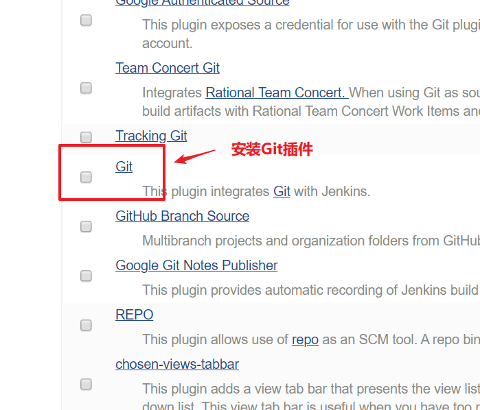

CentOS7 上安装 Git 工具：

```shell
# 安装
yum install git -y

# 安装后查看版本
git --version
```

### 2.7.3 用户密码类型

**1. 创建凭证**

`Jenkins->凭证->系统->全局凭证->添加凭证`：

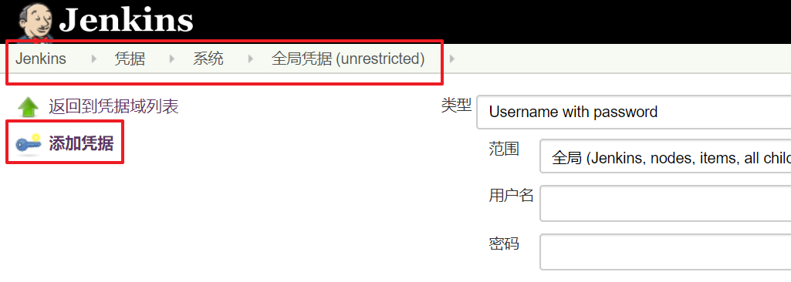


选择"Username with password"，输入 Gitlab 的用户名和密码，点击"确定"。


**2. 测试凭证是否可用**

创建一个 FreeStyle 项目：`新建Item->FreeStyle Project->确定`


找到`"源码管理"->"Git"`，在 Repository URL 复制 Gitlab 中的项目URL：


这时会报错说无法连接仓库！在 Credentials 选择刚刚添加的凭证就不报错啦。


保存配置后，点击构建”Build Now“ 开始构建项目：


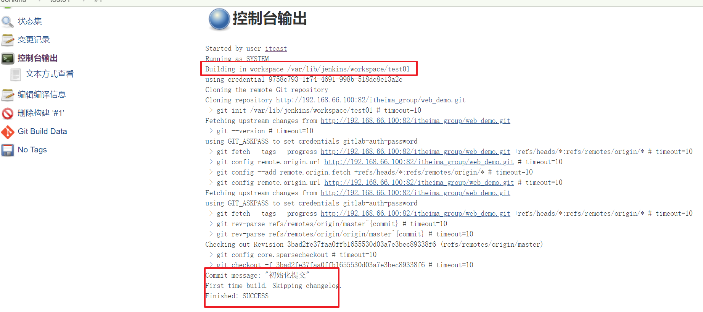

查看 `/var/lib/jenkins/workspace/` 目录，发现已经从 Gitlab 成功拉取了代码到 Jenkins 中。


### 2.7.4 SSH 密钥类型

SSH免密登录示意图：


**1. 使用 root 用户生成公钥和私钥**

```shell
ssh-keygen -t rsa
```

在 `/root/.ssh/` 目录保存了公钥和使用：


- `id_rsa`：私钥文件。
- `id_rsa.pub`：公钥文件。

**2. 把生成的公钥放在 Gitlab 中**

以root账户登录，点击 `头像->Settings->SSH Keys`，复制刚才 `id_rsa.pub` 文件的内容到这里，点击"Add Key"：


**3. 在 Jenkins 中添加凭证，配置私钥**

在 Jenkins 添加一个新的凭证，类型为"SSH Username with private key"，把刚才生成私有文件内容复制过来：


**4. 测试凭证是否可用**

新建 `"test02"项目->源码管理->Git`，这次要使用 Gitlab 的 SSH 连接，并且选择 SSH 凭证：


同样尝试构建项目，如果代码可以正常拉取，代表凭证配置成功！


## 2.8 持续集成环境(5) - Maven 安装和配置

在 Jenkins 集成服务器上，我们需要安装 Maven 来编译和打包项目。

### 2.8.1 安装 Maven

先上传 Maven 软件到 192.168.66.101：

```shell
# 解压
tar -xzf apache-maven-3.6.2-bin.tar.gz

# 创建目录
mkdir -p /opt/maven

# 移动文件
mv apache-maven-3.6.2/* /opt/maven
```

### 2.8.2 配置环境变量

`/etc/profile`

```shell
export JAVA_HOME=/usr/lib/jvm/java-1.8.0-openjdk
export MAVEN_HOME=/opt/maven
export PATH=$PATH:$JAVA_HOME/bin:$MAVEN_HOME/bin
```

然后：

```shell
# 配置生效
source /etc/profile

# 查找Maven版本
mvn -v
```

### 2.8.3 全局工具配置关联 JDK 和 Maven

`Jenkins->Global Tool Configuration->JDK->新增JDK`，配置如下：


`Jenkins->Global Tool Configuration->Maven->新增Maven`，配置如下：


### 2.8.4 添加 Jenkins 全局变量

`Manage Jenkins->Configure System->Global Properties` ，添加三个全局变量：

`JAVA_HOME`、`M2_HOME`、`PATH+EXTRA`


### 2.8.5 修改 Maven 的 settings.xml

```shell
# 创建本地仓库目录
mkdir /root/repo
```

`/opt/maven/conf/settings.xml`

```xml
<settings ...>
    ...
    <!-- 本地仓库改为 /root/repo/ -->
    <localRepository>/root/repo/</localRepository>
    ...
    <!-- 添加阿里云私服地址 -->
    <mirror>
        <id>aliyunmaven</id>
        <mirrorOf>*</mirrorOf>
        <name>阿里云公共仓库</name>
        <url>https://maven.aliyun.com/repository/public</url>
    </mirror>
    ...
</settings>
```

> 🙋‍♂️ 镜像仓库配置参考：https://developer.aliyun.com/mvn/guide。

### 2.8.6 测试 Maven 是否配置成功

使用之前的 Gitlab 密码测试项目，修改配置：


`构建->增加构建步骤->Execute Shell`：


输入：

```shell
mvn clean package
```


再次构建，如果可以把项目打成 wa r包，代表 Maven 环境配置成功啦！


## 2.9 持续集成环境(6)- Tomcat 安装和配置

### 2.9.1 安装 Tomcat 8.5

把 Tomcat 压缩包上传到 192.168.66.102 服务器：

```shell
#  安装JDK（已完成）
yum install java-1.8.0-openjdk* -y

# 解压
tar -xzf apache-tomcat-8.5.47.tar.gz

# 创建目录
mkdir -p /opt/tomcat

# 移动文件
mv /root/apache-tomcat-8.5.47/* /opt/tomcat

# 启动tomcat
/opt/tomcat/bin/startup.sh
```

> **注意：** 服务器已经关闭了防火墙，所以可以直接访问 Tomcat 啦。

地址为：http://192.168.66.102/8080。


### 2.9.2 配置 Tomcat 用户角色权限

默认情况下 Tomcat 是没有配置用户角色权限的：

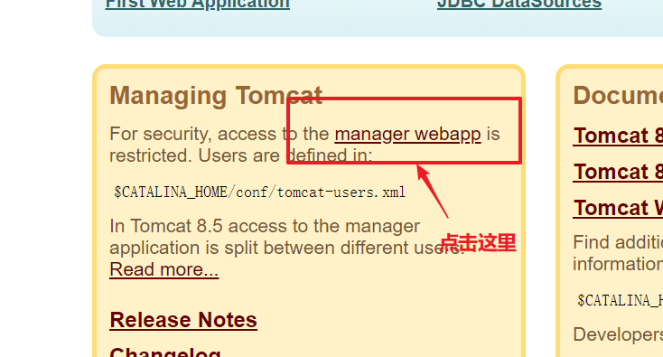


但是，后续 Jenkins 部署项目到 Tomcat 服务器，需要用到 Tomcat 的用户，所以修改 Tomcat 以下配置，添加用户及权限：

`/opt/tomcat/conf/tomcat-users.xml`

```xml
<tomcat-users>
    <role rolename="tomcat"/>
    <role rolename="role1"/>
    <role rolename="manager-script"/>
    <role rolename="manager-gui"/>
    <role rolename="manager-status"/>
    <role rolename="admin-gui"/>
    <role rolename="admin-script"/>
    <user username="tomcat" password="tomcat" roles="manager-gui,manager-
                                                     script,tomcat,admin-gui,admin-script"/>
</tomcat-users>
```

用户和密码都是：tomcat。

> 注意：为了能够刚才配置的用户登录到 Tomcat，还需要修改以下配置：

`/opt/tomcat/webapps/manager/META-INF/context.xml`

```xml
<!--
<Valve className="org.apache.catalina.valves.RemoteAddrValve"
       allow="127\.\d+\.\d+\.\d+|::1|0:0:0:0:0:0:0:1" />
-->
```

把上面这行注释掉即可！

### 2.9.3 重启 Tomcat，访问测试

```shell
# 停止
/opt/tomcat/bin/shutdown.sh

# 启动
/opt/tomcat/bin/startup.sh
```

访问：http://192.168.66.102:8080/manager/html，输入 tomcat 和 tomcat，看到以下页面代表成功啦。


